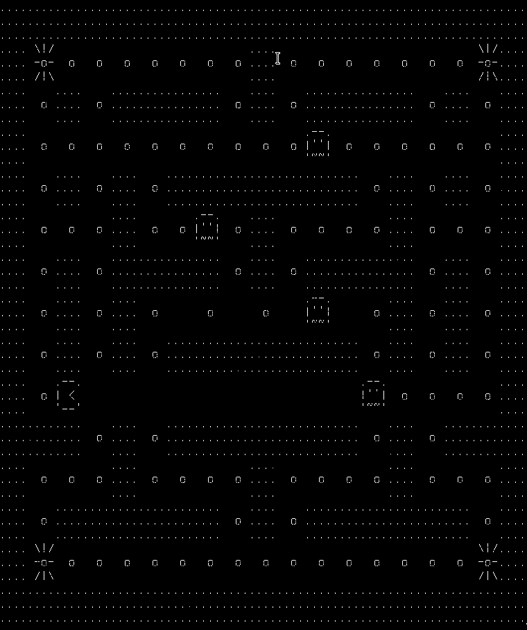

# Pacnelson

An ncuses text mode game, inspired by Pac-Man, written in C. Made for educational purposes.

It was partly built during a course, and then I implemented some new features and solved some bugs.



## Features implemented during the course:

- Map translation from simple characters to ASCII art.
- Pacnelson and Ghosts movements.
- WASD controls for choosing and Enter to make a move.
- Ghosts killing Pacnelson.
- The Bomb used to kill ghosts.

## Bugs I've fixed after the course:

- If Pacnelson was going towards a Ghost, the Ghost would die.

## Features I've implemented after the course:

- Addition of the library ncurses to avoid the printing on the terminal.
- Not need for Enter, the characters move by themselves.
- Addition of food.
- When Pacnelson eats all the food, the game ends.
- Use of Vim keys to move.
- A better Map and smaller ASCII art so the elements fit on the screen.

## Missing features:

- A way to quit the game. You have to either win or loose.
- A way to pause and resume the game.
- A highscore.

## Bugs:

- The map can not have empty spaces.
- The refresh rate is 350 miliseconds, but as soon as you hit a key, the game updates to the next frame. And if you hold a direction key, the game speed up like Tetris. I still don't know how to fix that. I used `timeout(350)` for the timeout and `getch()` to read the keyboard.

## Installation

You'll need:
- A Linux machine (pretty sure It won't work on Windows).
- A C compiler (I use gcc).
- Ncurses library.

Run as normal user:

``` sh
git clone https://github.com/anderson-m-souza/pacnelson
cd pacnelson
gcc -lncurses pacnelson.c map.c ui.c -o pacnelson
```

Start the game:

``` sh
./pacnelson
```

## Characters:

Pacnelson
```
.--.
| < 
'--'
```

Ghosts
```
.--.
|''|
'~~'
```

Food
```
    
  o 
    
```

Invisible Bomb
```
 \|/
 -o-
 /|\

```

Walls
```
....
....
....
```

## How to play

Commands:
- Left:      `A` or `H`
- Right:     `D` or `L`
- Up:        `W` or `K`
- Down:      `S` or `J`
- Explosion: `B`

If you eat an Invisible Bomb, you will be able to kill Ghosts in a radius of 3 spaces, vertically and horizontally, unless there is a wall in the middle.

You can eat more than 1 Bomb, but you can not accumulate them. It's only 1 Bomb at a time.

To explode a Bomb, hit `B`. You won't be able to see an explosion though, it's stealth. That's why the bomb is called "Invisible".
